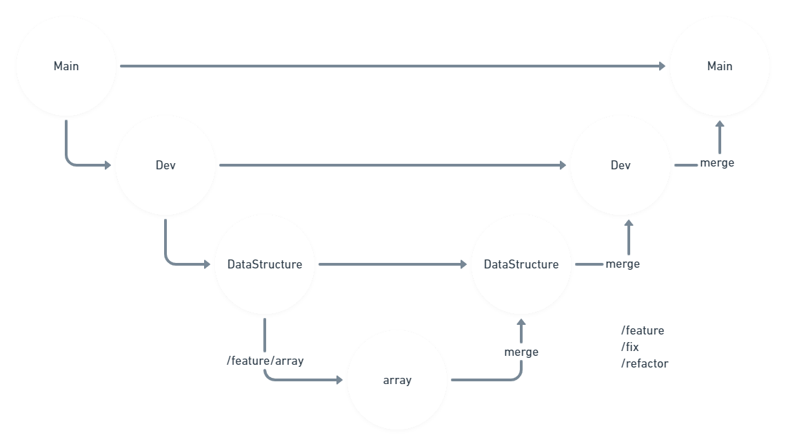

# Nano Lib
Pequena biblioteca com algorítimos reutilizáveis para C.  
Almeja o menor overhead possível possibilitando assim ativar/desativar as verificações de ponteiros, index range, etc...

## Git Flow
